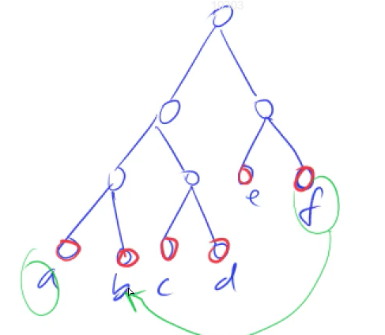

[148. 合并果子](https://www.acwing.com/problem/content/150/)

#### 算法：

*#贪心*

每次合并两个最小的点。

**证明**



#### 时间复杂度分析：


#### 代码：

```cpp
#include <iostream>
#include <queue>

using namespace std;

int n;

int main() {
    cin >> n;
    priority_queue<int, vector<int>, greater<int>> q;
    while (n--) {
        int t;
        cin >> t;
        q.push(t);
    }
    
    int ret = 0;
    while (q.size() > 1) {
        int a = q.top(); q.pop();
        int b = q.top(); q.pop();
        ret += a + b;
        q.push(a + b);
    }
    
    cout << ret << endl;
    
    return 0;
}
```

