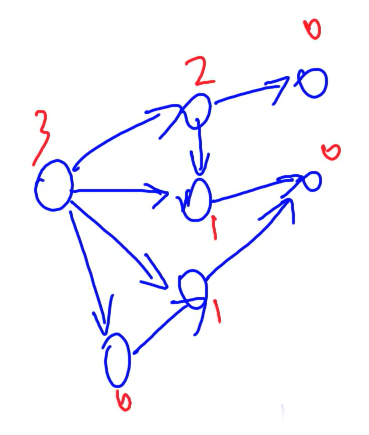

# 数学知识

质数、约数、欧拉函数、快速幂、扩展欧几里得算法、中国剩余定理、高斯消元、组合计数、容斥原理、简单博弈论。

---

#### 质数

如果大于 1 的整数 a 只包含 1 和本身这两个约数，就称 a 为质数，或者素数。

注：小于等于 1 的数，既不是质数也不是合数。

1. 质数的判定：试除法，时间复杂度 O(sqrt(n))。

2. 分解质因数：试除法，时间复杂度 O(sqrt(n))。

3. 求质数：

   - 埃氏筛选法，时间复杂度 O(n * loglogn)。

   - 线性筛选法，时间复杂度 O(n)。

#### 试除法判定质数

如果 d | n，则 (n / d) | n，其中 a | b 表示 a 能整除 b。可以发现 n 的约数是成对出现的，所以我们可以每次只枚举较小的约数。

d <= n / d -> d<sup>2</sup> <= n -> d <= sqrt(n)，时间复杂度是 O(sqrt(n))。

注：使用 i <= x / i 而不是 i * i <= n，因为 i * i 可能会溢出。

```java
bool isPrime(int x) {
    if (x < 2) return false;
    for (int i = 2; i <= x / i; i ++ ) {
        if (x % i == 0) return false;
    }
    return true;
}
```

#### 试除法分解质因数

从小到大枚举所有数，尝试是否为 n 的质因数。因为 n 中最多含有一个大于 sqrt(n) 的质因子（如果存在两个，乘积就大于 n 了），所以我们可以先枚举 <= sqrt(n) 的所有质因子，如果最后 n > 1，就说明最后剩下的数 n 是大于 sqrt(n) 的质因子。

时间复杂度 O(sqrt(n))，最差时间复杂度是 O(sqrt(n))，大部分时候优于 O(sqrt(n))，比如 2<sup>64</sup>。

可能枚举到合数，对结果是否有影响？

没有影响。因为当我们枚举到 i 时，说明我们已经枚举过 2 ~ i - 1 中的所有数字，也就说 n 中已经不包含 2 ~ i - 1 中因子了。如果 n 能够被 i 整除，i 中也不包含 2 ~ i - 1 中的因子，因此，当 x % i == 0 成立时，i 一定是一个质数。

```java
void divide(int x) {
    for (int i = 2; i <= x / i; i ++ ) {
        if (x % i == 0) {
            int s = 0;
            while (x % i == 0) {
                x /= i;
                s++;
            }
            System.out.println(i + " " + s);
        }
    }
    if (x > 1) System.out.println(x + " " + 1);
}
```

#### 朴素筛法求素数

1. 将所有数先写到数表中。
2. 从前往后看，删除每个数的所有倍数。

如上筛选过后，剩下的数就是质数。

因为对于任何一个数 p，如果 p 没有被删除，说明 p 不是 2 ~ p - 1 中任何一个数的倍数，也就是 2 ~ p -1 中不存在 p 的约数，所以 p 就是一个质数。

时间复杂度分析：n / 2 + n / 3 + ... + n / n = n * (1 / 2 + 1 / 3 + ... + 1 / n) = n * lnn = O(n * logn)。

埃氏筛法

优化：只需将质数的倍数删除。

假设 p 是一个质数，根据算术基本定理，只要 2 ~ p - 1 中所有的质数不是 p 的约数，那么 p 就是一个质数，所以只要用素数筛选就行了。

算术基本定理：任何一个大于 1 的自然数 n，如果 n 不为质数，那么 n 可以唯一分解成有限个质数的乘积。

时间复杂度分析：由质数定理：1 ~ n 中有 n / lnn 个质数，可以粗略估计时间复杂度为 n * lnn / lnn = n，真实复杂度是 O(n * loglogn)

```java
int cnt;
int[] primes = new int[N]; // 数组 primes 存储所有素数
boolean[] st = new boolean[N]; // st[x] 存储 x 是否被筛掉       

void getPrimes(int n) {
    for (int i = 2; i <= n; i++) {
        if (st[i]) continue;
        primes[cnt++] = i;
        for (int j = i + i; j <= n; j += i) {
            st[j] = true;
        }
    }
}
```

#### 线性筛法求素数

把每个合数用它的质因子筛掉：核心思想就是用最小质因子筛，如果此时 p[j] | i，由于是从小到大枚举所有质数，所以之后的 p[j] 必然不是 p[j] * i 的最小质因子。

- 保证 n 只会被最小质因子筛掉：

  - i % primes[j] == 0

  因为是从小到大枚举所有质数的，所以当 p[j] | i 时，primes[j] 是 i 的最小质因子，也就是说 primes[j] 一定是 primes[j] * i 的最小质因子，可以将 primes[j] * i 筛掉。

  当第一次出现 i % primes[j] == 0 时，就可以 break 掉了，已经找到 i 的最小质因子，无法再利用 i 进行筛选了。

  - i % primes[j] != 0

    因为从小到大枚举所有质数，并且没有枚举到 i 的任何一个质因子，说明 primes[j] 小于 i 的所有质因子，所以 primes[j] 也一定是 primes[j] * i 的最小质因子，可以将 primes[j] * i 筛掉。

  所有不管什么情况，当 st[primes[j] * i] = true 筛选的时候，一定有 primes[j] 是 primes[j] * i 的最小质因子，所以筛选的时候我们一定是用它的最小质因子筛掉。

- 任何一个合数都会被筛掉：

  因为任何一个合数 x，一定存在最小质因子，假设 primes[j] 是 x 的最小质因子，当 i 枚举到 x / primes[j] 的时候，就可以把它筛掉，并且筛的时候是使用最小质因子筛的。而每个数只有一个最小质因子，所以每个数只会被筛一次，也就是说时间复杂度是线性的。

```java
int cnt;
int[] primes = new int[N]; // 数组 primes 存储所有素数
boolean[] st = new boolean[N]; // st[x] 存储 x 是否被筛掉

void getPrimes(int n) {
    for (int i = 2; i <= n; i++) {
        if (!st[i]) primes[cnt++] = i;
        for (int j = 0; primes[j] <= n / i; j++) {
            st[primes[j] * i] = true;
            if (i % primes[j] == 0) break;
        }
    }
}
```

#### 约数

1. 试除法求一个数的所有约数。
2. 约数个数。
3. 约数之和。
4. 欧几里得算法。

#### 试除法求所有约数

优化：同试除法判定质数，约数是成对出现的，所以只需枚举较小的约数，只用枚举到 sqrt(n)，时间复杂度是 O(sqrt(n))。

注：为了防止 x / i * x / i == x 时放入相同的两个约数，使用判断 if (i != x / i) res.add(x / i)。

这个与试除法分解质因数不同的地方是，前者只用求出约数，而后者需要求出约数及其个数。对于前者中大于 sqrt(n) 的约数，可以通过与它成对出现的较小的约数来求出。

```java
List<Integer> getDivisors(int x) {
    List<Integer> ret = new ArrayList<>();
    for (int i = 1; i <= x / i; i ++ ) {
        if (x % i == 0) {
            ret.add(i);
            if (i != x / i) ret.add(x / i);
        }
    }
    
    ret.sort((o1, o2) -> o1 - o2);
    return ret;
}
```

#### 约数个数和约数之和

如果 N = p1<sup>c1</sup> * p2<sup>c2</sup> * ... *pk<sup>ck</sup>：

- 约数个数：(c1 + 1) * (c2 + 1) * ... * (ck + 1)

  N 的任何一个约数都可以表示为 N = p1<sup>b1</sup> * p2<sup>b2</sup> * ... *pk<sup>bk</sup>，其中 0 <= bi <= ci。每一项的指数不同则约数不同，所以约数的个数就和 bi 的的取法个数相同，bi 的取法个数为 (c1 + 1) * (c2 + 1) * ... * (ck + 1)。

- 约数之和：(p1<sup>0</sup> + p1<sup>1</sup> + ... + p1<sup>c1</sup>) * ... * (pk<sup>0</sup> + pk<sup>1</sup> + ... + pk<sup>ck</sup>)

  展开后就是约数之和。

#### 欧几里得算法

辗转相除法。

a 和 b 的最大公约数可以看成 b 和 a mod b 的最大公约数。

证明：

a mod b = a - ⌊a / b⌋ * b = a - c * b（a / b = ⌊a / b⌋ + r 可以推出余数 a mod b = r = a - ⌊a / b⌋ * b。），可以将 (b, a % b) 转化为 (b, a - c * b)。

- 对于 (a, b) 的任意一个公约数 d，d | a 并且 d | b，所以 d | (a - c * b)，d 是 b 的约数，d也是 a - c * b 的约数，也就是说 d 是 (b, a - c * b) 的公约数。

- 对于 (b, a - c * b)  的任意一个公约数 d，d | b 并且 b |(a - c * b)，所以 d | (c * b + a - c * b)，也就是 d | a，所以 d 是 (a, b) 的公约数。

所以 (a, b) 和 (b, a - c * b) 的公约数集合相同，也就是说a 和 b 的最大公约数可以看成 b 和 a mod b 的最大公约数。

注：如果 d | a 并且 d | b，则 d | (a + b)，d | (ax + by)，a | b 表示 a 能整除 b。

```java
int gcd(int a, int b) {
    return b == 0 ? a : gcd(b, a % b);
}
```

#### 求欧拉函数

欧拉函数 φ(n) 表示 1 ~ n 中与 n 互质的数的个数。

结论：如果 n 分解质因数为 n = p<sub>1</sub><sup>a1</sup> * p<sub>2</sub><sup>a2</sup> * ... *p<sub>k</sub><sup>ak</sup>， 那么欧拉函数就是 φ(n) = n * (1 - 1 / p<sub>1</sub>) * (1 - 1 / p<sub>2</sub>) * ... * (1 - 1 / p<sub>k</sub>)。

时间复杂度：瓶颈是分解质因数，O(n<sup>1/2</sup>)。

用处：欧拉定理（若 a 与 n 互质，则 a<sup>φ(n)</sup> ≡ 1 (mod n)，欧拉定理的推论：费马小定理（当 p 是质数时，若 a 与 p 互质，则 a<sup>p - 1</sup> ≡ 1 (mod p)）。

证明（容斥原理）：

- 从 1 ~ n 中去掉 p<sub>1</sub>，p<sub>2</sub>，...，p<sub>k</sub> 的所有倍数，这些倍数一定是不和 n 互质的，因为它们和 n 有公因子 p<sub>i</sub>。

  n - ⌊n / p<sub>1</sub>⌋ - ⌊n / p<sub>2</sub>⌋ - ... 

- 如果一个数既是 p<sub>1</sub> 的倍数又是 p<sub>2</sub> 的倍数的话，这个数会被去除两次（p<sub>1</sub> 一次，p<sub>2</sub> 一次），也就是多去除了一次，所以应该加上所有 p<sub>i</sub> * p<sub>j</sub> 的倍数。

  n - ⌊n / p<sub>1</sub>⌋ - ⌊n / p<sub>2</sub>⌋ - ... + ⌊n / (p<sub>1</sub> * p<sub>2</sub>)⌋ + ⌊n / (p<sub>1</sub> * p<sub>3</sub>)⌋ + ...

- 如果一个数既是 p<sub>1</sub> 的倍数又是 p<sub>2</sub> 的倍数同时又是 p<sub>3</sub> 的倍数的话，它会在第一步 p<sub>1</sub>，p<sub>2</sub>，p<sub>3</sub> 各减一次，又会在第二步 p<sub>1</sub> 和 p<sub>2</sub> 的倍数，p<sub>1</sub> 和 p<sub>3</sub> 的倍数，p<sub>2</sub> 和 p<sub>3</sub> 的倍数各加一次，就相当于没有减也没有加，但实际上它是需要去掉的，所以应该减去所有 pi * pj * pk 的倍数。

  n - ⌊n / p<sub>1</sub>⌋ - ⌊n / p<sub>2</sub>⌋ - ... + ⌊n / (p<sub>1</sub> * p<sub>2</sub>)⌋ + ⌊n / (p<sub>1</sub> * p<sub>3</sub>)⌋ + ... - ⌊n / (p<sub>1</sub> * p<sub>2</sub> * p<sub>3</sub>)⌋ - ⌊n / (p<sub>1</sub> * p<sub>2</sub> * p<sub>4</sub>)⌋ - ...

- 以此类推，得到的公式与 n * (1 - 1 / p<sub>1</sub>) * (1 - 1 / p<sub>2</sub>) * ... * (1 - 1 / p<sub>k</sub>) 展开相同，所以 1 ~ n 中与 n 互质的数的个数就是 φ(n) = n * (1 - 1 / p<sub>1</sub>) * (1 - 1 / p<sub>2</sub>) * ... * (1 - 1 / p<sub>k</sub>)。

注：公式中都是整除运算，不能包含小数，需要将 `res * (1 - 1 / i)` 化简成成 ` res = res / i * (i - 1)`。

```java
int phi(int x) {
    int res = x;
    for (int i = 2; i <= x / i; i++) {
        if (x % i == 0) {
            res = res / i * (i - 1);
            while (x % i == 0) x /= i;
        }
    }
    if (x > 1) res = res / x * (x - 1);

    return res;
}
```

#### 筛法求欧拉函数

当需要求 1 ~ n 中每个数的欧拉函数时，使用线性筛法可以在 O(n) 的时间复杂度内计算出每一个数的欧拉函数。

- 当 i 为质数时，显然有 i - 1 个与 i 互质的数（1 ~ i - 1），euler[i] = i - 1。

- 当 i mod primes[j] = 0 时，primes[j] 是 i 中的一个质因子，所以

  φ(i)    	             =          		    i * (i - 1 / p<sub>1</sub>) * ... * (1 - 1 / p<sub>k</sub>)

  φ(primes[j] * i) = primes[j] *  i * (i - 1 / p<sub>1</sub>) * ... * (1 - 1 / p<sub>k</sub>)

  也就是 φ(primes[j] * i) = primes[j] * φ(i)。

- 当 i mod primes[j] != 0 时，primes[j] 不是 i 中的一个质因子，所以

  φ(i)    	             =          		    i * (i - 1 / p<sub>1</sub>) * ... * (1 - 1 / p<sub>k</sub>)

  φ(primes[j] * i) = primes[j] *  i * (i - 1 / p<sub>1</sub>) * ... * (1 - 1 / p<sub>k</sub>) * (1 - 1 / primes[j])

  也就是 φ(primes[j] * i) = primes[j] * φ(i) * (1 - 1 / primes[j]) = φ(i) * (primes[j] - 1)。

注：φ(1) = 1。

```java
int cnt;
int[] primes = new int[N]; // primes[] 存储所有素数
int[] euler = new int[N]; // 存储每个数的欧拉函数
boolean[] st = new boolean[N]; // st[x] 存储 x 是否被筛掉

void getEulers(int n) {
    euler[1] = 1;
    for (int i = 2; i <= n; i++) {
        if (!st[i]) {
            primes[cnt++] = i;
            euler[i] = i - 1;
        }
        for (int j = 0; primes[j] <= n / i; j++) {
            int t = primes[j] * i;
            st[t] = true;
            if (i % primes[j] == 0) {
                euler[t] = euler[i] * primes[j];
                break;
            }
            euler[t] = euler[i] * (primes[j] - 1);
        }
    }
}
```

#### 快速幂

可以在 O(logk) 的时间复杂度内，求出 m<sup>k</sup> mod p，其中 m, k, p ∈ [1, 10<sup>9</sup>]。

核心思想：预处理出 m<sup>2<sup>0</sup></sup> mod p，m<sup>2<sup>1</sup></sup> mod p，m<sup>2<sup>2</sup></sup> mod p，...，m<sup>2<sup>logk</sup></sup> mod p，然后将 m<sup>k</sup> 拆分成前面预处理的若干个值的乘积的形式：m<sup>k</sup> = m<sup>2<sup>i</sup></sup> * m<sup>2<sup>j</sup></sup> * m<sup>2<sup>k</sup></sup> * ... = m<sup>2<sup>i</sup> + 2<sup>j</sup> + 2<sup>k</sup> + ...</sup>，也就是将 k 拆分成 2<sup>0</sup>，2<sup>1</sup>，2<sup>2</sup>，... 的和。

- 预处理方法：m<sup>2<sup>0</sup></sup>，m<sup>2<sup>1</sup></sup> = (m<sup>2<sup>0</sup></sup>)<sup>2</sup>，m<sup>2<sup>2</sup></sup> = (m<sup>2<sup>1</sup></sup>)<sup>2</sup>，...。
- 将 k 转换为二进制：假设 (k)<sub>10</sub> = (110110)<sub>2</sub>，就可以得到 k = 2<sup>1</sup> + 2<sup>2</sup> + 2 <sup>4</sup> + 2<sup>5</sup>。

```java
int qmi(int m, int k, int p) {
    int res = 1 % p, t = m;
    while (k != 0) {
        if (k & 1 == 1) res = res * t % p;
        t = t * t % p;
        k >>= 1;
    }
    return res;
}
```

#### 扩展欧几里得算法

裴蜀定理：对于任意一对正整数 a, b，一定存在非零整数 x, y，使得 ax + by =  gcd(a, b)。

可以使用扩展欧几里得算法求出 x, y，使得 ax + by = gcd(a, b)。

- 当 b = 0 时，gcd(a, 0) = a，可以明显看出构造：a * x + 0 * y = a，其中 x = 1，y = 0。

- 当 b != 0 时，因为 gcd(a, b) = gcd(b, a mod b) = d，我们可以先递归的求出 d = exgcd(b, a % b, y, x)（反转一下 x 和 y，方便化简计算），然后反推出 exgcd(a, b, x, y)。

  由递归可以知道 b 的系数和 a % b 的系数：

  b * y + (a mod b) * x = d，其中 a mod b = a - ⌊a / b⌋ * b

  化简得到：

  a * x + b * (y - ⌊a / b⌋ * x) = d

  可以推出 a 的系数是 x，b 的系数是 y - ⌊a / b⌋ * x。

```java
int exgcd(int a, int b, int &x, int &y) {
    if (!b) {
        x = 1, y = 0;
        return a;
    }
    int d = exgcd(b, a % b, y, x);
    y -= (a / b) * x;
    return d;
}
```

#### 乘法逆元

若整数 b，m 互质，并且对于任意的整数 a，如果满足 b|a，则存在一个整数 x，使得 a / b ≡ a ∗ x (mod m)，则称 x 为 b 的模 m 乘法逆元，记为 b<sup>−1</sup>(mod m)。

b 存在乘法逆元的充要条件是 b 与模数 m 互质。当模数 m 为质数时，b<sup>m−2</sup> 即为 b 的乘法逆元。

证明：

给定一个 b，使得 b * x ≡ 1(mod p)，x 就是 b mod p 的逆元，其中 p 是质数， b 和 p 是互质的，由费马小定理 b<sup>p - 1</sup> ≡ 1(mod p) 得 b * b<sup>p - 2</sup> ≡ 1(mod p)，所以 x = b<sup>p - 2</sup>。

当 b 和 p 不互质时，b 是 p 的倍数，b * x 也是 p 的倍数，mod p 一定等于 0，不可能余 1，所以不存在逆元。

注：当模数 m 不是质数时，可以使用扩展欧几里得算法求逆元。

b * x ≡ 1 (mod m) 等价于存在整数 y，使得 b * x = m * y + 1，移项得到 a * x - m * y = 1，设 y' = -y，则 a * x + m * y' = 1，可以使用扩展欧几里得算法求 x。

#### 中国剩余定理

给定 m<sub>1</sub>, m<sub>2</sub>, ...,m<sub>k</sub>，它们两两互质，解决线性同于方程组：

​										x ≡ a<sub>1</sub> (mod m<sub>1</sub>)

​										x ≡ a<sub>2</sub> (mod m<sub>2</sub>)

​										...

​										x ≡ a<sub>k</sub> (mod m<sub>k</sub>)

有公式解：x = a<sub>1</sub> * M<sub>1</sub> * M<sub>1</sub><sup>-1</sup> + a<sub>2</sub> * M<sub>2</sub> * M<sub>2</sub><sup>-1</sup> + ... + a<sub>k</sub> * M<sub>k</sub> * M<sub>k</sub><sup>-1</sup>，这个就被称为中国剩余定理。

其中 M = m1 * m2 * ... * mk，Mi = M / mi，Mi-1 表示 Mi 模 mi 的逆。

证明：

x mod m<sub>1</sub> = a<sub>1</sub> * M<sub>1</sub> * M<sub>1</sub><sup>-1</sup> + a<sub>2</sub> * M<sub>2</sub> * M<sub>2</sub><sup>-1</sup> + ... + a<sub>k</sub> * M<sub>k</sub> * M<sub>k</sub><sup>-1</sup> mod m<sub>1</sub>

其中 M<sub>1</sub> * M<sub>1</sub><sup>-1</sup> = 1；因为 M<sub>2</sub>，M<sub>3</sub>，...，M<sub>k</sub> 都包含 m<sub>1</sub>，所以后面每一项 mod m<sub>1</sub> 都等于 0，可以得到 x mod m<sub>1</sub> = a<sub>1</sub>。

其余线性同于方程证明同理。

其中 M = m<sub>1</sub> * m<sub>2</sub> * ... * m<sub>k</sub>，M<sub>i</sub> = M / m<sub>i</sub>，M<sub>i</sub><sup>-1</sup> 表示 M<sub>i</sub> 模 m<sub>i</sub> 的逆。

#### 高斯消元

高斯消元可以在 O(n<sup>3</sup>) 的时间复杂度内，求解包含 n 个方程和 n 个未知数的多元线性方程组。

原理：

通过初等行列变换对原始方程组进行恒等变换（变换前后，解是相同的），得到阶梯型矩阵：

- 完美阶梯型，n 个方程 n 个未知数，则有唯一解。
- 出现 0 = 非零的方程，矛盾，则无解。
- 出现 0 = 0 的方程，也就是方程个数小于未知数的个数，则有无穷多解。

其中初等行列变换包括：、把某一行乘一个非零的数、交换某 2 行、把某行的若干倍加到另一行上去。

算法：

枚举每一列 c

1. 找到绝对值最大的一行。
2. 将该行换到最上面。
3. 将该行第一个非零的数变成 1。
   4. 将下面所有行的第 c 列消成 0。

注：每次将某一行换到最上面后，该行位置就固定了，下次枚举列时，只用考虑剩下的行。

```java
// a[N][N]是增广矩阵
int gauss() {
    int c, r;
    for (c = 0, r = 0; c < n; c++) {
        int t = r;
        for (int i = r; i < n; i++) { // 找到绝对值最大的行
            if (fabs(a[i][c]) > fabs(a[t][c])) t = i;
        }

        if (fabs(a[t][c]) < eps) continue;

        for (int i = c; i <= n; i++) swap(a[t][i], a[r][i]); // 将绝对值最大的行换到最顶端
        for (int i = n; i >= c; i--) a[r][i] /= a[r][c]; // 将当前上的首位变成 1
        for (int i = r + 1; i < n; i++) { // 用当前行将下面所有的列消成 0
            if (fabs(a[i][c]) > eps) {
                for (int j = n; j >= c; j--) {
                    a[i][j] -= a[r][j] * a[i][c];
                }
            }
        }

        r++;
    }

    if (r < n) {
        for (int i = r; i < n; i ++ ) {
            if (fabs(a[i][n]) > eps) return 2; // 无解
        }
        return 1; // 有无穷多组解
    }

    for (int i = n - 1; i >= 0; i -- ) {
        for (int j = i + 1; j < n; j ++ ) {
            a[i][n] -= a[i][j] * a[j][n];
        }
    }

    return 0; // 有唯一解
}
```

#### 组合数

C<sub>a</sub><sup>b</sup> = (a * (a - 1) * ... * (a - b + 1)) / (1 * 2 * 3 * ... * b) = a! / (b! * (a - b)!)

- 10 万组，1 <= b <= a <= 2000：递归法求组合数，O(n<sup>2</sup>)。
- 1 万组，1 <= b <= a <= 10<sup>5</sup>：通过预处理逆元的方式求组合数，O(n * logn)。
- 20 组，1 <= b <= a <= 10<sup>18</sup>，1 <= p <= 10<sup>5</sup>：卢卡斯定理，O(log<sub>p</sub><sup>n</sup> * plog<sub>2</sub><sup>p</sup>) = O(p * logn)，其中 n 是组合数的下界，p 是取模的质数。
- 求出组合数的真实值，而非对某个数的余数时，分解质因数法求组合数。

注：在组合数中如果只说模上一个数 p，就要自己判断 p 是不是质数，是质数就用快速幂求逆元，不是质数就要用扩展欧几里得求逆元。如果 p 和分母不互质的话就要对 p 分解质因数分别求，然后再用中国剩余定理把答案组合起来。

#### 递归法求组合数

C<sub>n</sub><sup>m</sup> = C<sub>n - 1</sub><sup>m</sup> + C<sub>n - 1</sub><sup>m -1</sup>

假设 n 个数中存在一个数 a，我们就有一种不含 a 的选法：从除 a 以外的 n - 1 个数中选 m 个；还有一种包含 a 的选法：从选完 a 后剩下的 n - 1 个数中选 m - 1 个，这两种选法包含了所有情况。

```java
// c[a][b] 表示从 a 个苹果中选 b 个的方案数
for (int i = 0; i < N; i++) {
    for (int j = 0; j <= i; j++) {
        if (!j) c[i][j] = 1;
        else c[i][j] = (c[i - 1][j] + c[i - 1][j - 1]) % mod;
    }
}
```

#### 通过预处理逆元的方式求组合数

C<sub>a</sub><sup>b</sup> = a! / (b! * (a - b)!)

因为 (a / b) mod p != (a mod p) / (b mod p)，所以我们一般把除法转化成乘法来处理。

首先预处理出所有阶乘取模的余数 fact[N] = i! mod (1<sup>9</sup> + 7)，以及所有阶乘取模的逆元 infact[N] =  (i!)<sup>-1</sup> mod (1<sup>9</sup> + 7)，然后就可以得到：

C<sub>a</sub><sup>b</sup> = fact[a] * infact[b] * infact[b - a]。

注：如果取模的数是质数，可以用费马小定理求逆元。

```java
int qmi(int a, int k, int p) { // 快速幂模板
    int res = 1;
    while (k) {
        if (k & 1) res = (LL)res * a % p;
        a = (LL)a * a % p;
        k >>= 1;
    }
    return res;
}

// 预处理阶乘的余数和阶乘逆元的余数
fact[0] = infact[0] = 1;
for (int i = 1; i < N; i++) {
    fact[i] = (LL)fact[i - 1] * i % mod;
    infact[i] = (LL)infact[i - 1] * qmi(i, mod - 2, mod) % mod;
}
```

#### Lucas定理

若 p 是质数，则对于任意整数 1 <= m <= n，有：

C<sub>n</sub><sup>m</sup> ≡ C<sub>n % p</sub><sup>m % p</sup> * C<sub>n / p</sub><sup>m / p</sup> (mod p)。

```java
int qmi(int a, int k, int p) { // 快速幂模板
    int res = 1;
    while (k) {
        if (k & 1) res = (LL)res * a % p;
        a = (LL)a * a % p;
        k >>= 1;
    }
    return res;
}

int C(int a, int b, int p) { // 通过定理求组合数 C(a, b) % p
    int res = 1;
    for (int i = 1, j = a; i <= b; i ++, j -- ) {
        res = (LL)res * j % p;
        res = (LL)res * qmi(i, p - 2, p) % p;
    }
    return res;
}

int lucas(LL a, LL b) {
    if (a < p && b < p) return C(a, b);
    return (LL)C(a % p, b % p) * lucas(a / p, b / p) % p;
}
```

#### 分解质因数法求组合数

C<sub>a</sub><sup>b</sup> = a! / (b! * (a - b)!) = p<sub>1</sub><sup>a<sub>1</sub></sup> * p<sub>2</sub><sup>a<sub>2</sub></sup> * ... p<sub>k</sub><sup>a<sub>k</sub></sup>

当我们需要求出组合数的真实值，而非对某个数的余数时，分解质因数的方式比较好用：

1. 筛法求出范围内的所有质数。
2. 通过 C<sub>a</sub><sup>b</sup> = a! / b! / (a - b)! 这个公式求出每个质因子的次数。 n! 中p的次数 n / p + n / p^2 + n / p^3 + ...。
3. 用高精度乘法将所有质因子相乘。

```cpp
int primes[N], cnt;     // 存储所有质数
int sum[N];     // 存储每个质数的次数
bool st[N];     // 存储每个数是否已被筛掉

void get_primes(int n) { // 线性筛法求素数
    for (int i = 2; i <= n; i++) {
        if (!st[i]) primes[cnt++] = i;
        for (int j = 0; primes[j] <= n / i; j++) {
            st[primes[j] * i] = true;
            if (i % primes[j] == 0) break;
        }
    }
}

int get(int n, int p) { // 求n！中的次数
    int res = 0;
    while (n) {
        res += n / p;
        n /= p;
    }
    return res;
}


vector<int> mul(vector<int> a, int b) { // 高精度乘低精度模板
    vector<int> c;
    int t = 0;
    for (int i = 0; i < a.size(); i ++ ) {
        t += a[i] * b;
        c.push_back(t % 10);
        t /= 10;
    }

    while (t) {
        c.push_back(t % 10);
        t /= 10;
    }

    return c;
}

get_primes(a);  // 预处理范围内的所有质数

for (int i = 0; i < cnt; i++) { // 求每个质因数的次数
    int p = primes[i];
    sum[i] = get(a, p) - get(b, p) - get(a - b, p);
}

vector<int> res;
res.push_back(1);

for (int i = 0; i < cnt; i++) { // 用高精度乘法将所有质因子相乘
    for (int j = 0; j < sum[i]; j++) {
        res = mul(res, primes[i]);
    }
}     
```

#### 卡特兰数

给定 n 个 0 和 n 个 1，它们按照某种顺序排成长度为 2n 的序列，满足任意前缀中 0 的个数都不少于 1 的个数的序列的数量为：Cat(n) = C<sub>2n</sub><sup>n</sup> / (n + 1)。

#### 容斥原理


S = S<sub>1</sub> + S<sub>2</sub> + S<sub>3</sub> - S<sub>1</sub> ∩ S<sub>2</sub> - S<sub>1</sub> ∩ S<sub>3</sub> - S<sub>2</sub> ∩ S<sub>3</sub> + S<sub>1</sub> ∩ S<sub>2</sub> + S<sub>3</sub>，适用于 n 个圆的面积，并且面积可以拓展为集合。

|S<sub>1</sub> ∪ S<sub>2</sub> ∪ ... ∪ S<sub>n</sub>| = ∑|S<sub>i</sub>| - ∑|S<sub>i</sub> ∩ S<sub>j</sub>| + ∑|S<sub>i</sub> ∩ S<sub>j</sub> ∩ S<sub>k</sub>| + ...，这就是容斥原理。

时间复杂度：C<sub>n</sub><sup>1</sup> + C<sub>n</sub><sup>2</sup> + C<sub>n</sub><sup>3</sup> + ... + C<sub>n</sub><sup>n</sup>，从 n 个数中挑任意多个数的方案数，从前往后看，第一个数选或不选，第二个数选或不选，...，所以等于 2<sup>n</sup> - C<sub>n</sub><sup>0</sup> = 2<sup>n</sup> - 1。

证明：对于 |S<sub>1</sub> ∪ S<sub>2</sub> ∪ ... ∪ S<sub>n</sub>| 中任意一个点 x，假设 x 属于 k 个集合。∑|S<sub>i</sub>| 中 x 出现 C<sub>k</sub><sup>1</sup> 次，∑|S<sub>i</sub> ∩ S<sub>j</sub>| 中 x 出现 C<sub>k</sub><sup>2</sup>，一直到最后 (-1)<sup>k - 1</sup>C<sub>k</sub><sup>k</sup>，=1。

对于 |S<sub>1</sub> ∪ S<sub>2</sub> ∪ ... ∪ S<sub>n</sub>| 中任意一个点 x，在右边统计的时候之后被统计一次，所以左边的元素个数就是右边统计的结果。

#### NIM游戏

给定 N 堆物品，第 i 堆物品有 A<sub>i</sub> 个。两名玩家轮流行动，每次可以任选一堆，取走任意多个物品，可把一堆取光，但不能不取。取走最后一件物品者获胜。两人都采取最优策略，问先手是否必胜。

我们把这种游戏称为 NIM 博弈。把游戏过程中面临的状态称为局面。整局游戏第一个行动的称为先手，第二个行动的称为后手。若在某一局面下无论采取何种行动，都会输掉游戏，则称该局面必败。

所谓采取最优策略是指，若在某一局面下存在某种行动，使得行动后对面面临必败局面，则优先采取该行动。同时，这样的局面被称为必胜。我们讨论的博弈问题一般都只考虑理想情况，即两人均无失误，都采取最优策略行动时游戏的结果。

NIM博弈不存在平局，只有先手必胜（可以到达某一个必败状态）和先手必败（走不到任何一个必状态）两种情况。

定理：NIM 博弈先手必胜，当且仅当 A<sub>1</sub> ^ A<sub>2</sub> ^ … ^ A<sub>n</sub> != 0。

证明：

1. 最终每堆物品的个数是 0，不能再进行操作，A<sub>1</sub> ^ A<sub>2</sub> ^ ... ^ A<sub>n</sub> = 0。

2. 当 A<sub>1</sub> ^ A<sub>2</sub> ^ ... ^ A<sub>n</sub> = x != 0 时，一定可以通过每种操作使 A<sub>1</sub> ^ A<sub>2</sub> ^ ... ^ A<sub>n</sub> = 0。

   假设 x 的二进制表示中最高一位 1 在第 k 位，那么 A<sub>1</sub> ~ A<sub>n</sub> 中必然存在一个数 A<sub>i</sub>，A<sub>i</sub> 的第 k 为是 1。使用 A<sub>i</sub> ^ x，x 最高位的 1 与 A<sub>i</sub> 第 k 位上的 1 异或等于 0，所以不管第 k 位之后的位变为什么， A<sub>i</sub> 一定是变小的，也就是 A<sub>i</sub> ^ x < A<sub>i</sub>。

   然后我们把第 i 堆物品减去 A<sub>i</sub> - (A<sub>i</sub> ^ x)，也就是 A<sub>i</sub> - (A<sub>i</sub> - (A<sub>i</sub> ^ x)) = A<sub>i</sub> ^ x，这样剩下的物品异或和等于 A<sub>1</sub> ^ A<sub>2</sub> ^ ... ^ A<sub>i</sub> ^ x ^ ... ^ A<sub>n</sub> = x ^ x = 0。

3. 当 A<sub>1</sub> ^ A<sub>2</sub> ^ ... ^ A<sub>n</sub> = 0 时，不管怎么操作都不能使 A<sub>1</sub> ^ A<sub>2</sub> ^ ... ^ A<sub>n</sub> = 0。

   假设操作第 i 堆物品，使得 A<sub>1</sub> ^ A<sub>2</sub> ^ ... ^ A<sub>i</sub><sup>'</sup> ^ ... ^ A<sub>n</sub> = 0。那么使用 A<sub>1</sub> ^ A<sub>2</sub> ^ ... ^ A<sub>n</sub> 异或 A<sub>1</sub> ^ A<sub>2</sub> ^ ... ^ A<sub>i</sub><sup>'</sup> ^ ... ^ A<sub>n</sub>，可以得到 A<sub>i</sub><sup>'</sup> ^ A<sub>i</sub> = 0，说明 A<sub>i</sub><sup>'</sup> = A<sub>i</sub>，但是我们需要拿走一些物品不能不拿，所以矛盾了，假设不成立。

因为每次操作都需要拿走一些物品不能不拿，所以游戏一定是可以终止的。在游戏过程中，如果初始情况 A<sub>1</sub> ^ A<sub>2</sub> ^ ... ^ A<sub>n</sub> = x != 0，那么先手时每堆物品异或和一定不是零，后手时每堆物品异或和一定是零，所以全零的状态一定时会被后手遇到，也就是先手必胜。

#### 公平组合游戏ICG

若一个游戏满足：

- 由两名玩家交替行动。
- 在游戏进程的任意时刻，可以执行的合法行动与轮到哪名玩家无关。
- 不能行动的玩家判负。

则称该游戏为一个公平组合游戏。

NIM 博弈属于公平组合游戏，但城建的棋类游戏，比如围棋，就不是公平组合游戏。因为围棋交战双方分别只能落黑子和白子，胜负判定也比较复杂，不满足条件 2 和条件 3。

#### 有向图游戏

给定一个有向无环图，图中有一个唯一的起点，在起点上放有一枚棋子。两名玩家交替地把这枚棋子沿有向边进行移动，每次可以移动一步，无法移动者判负。该游戏被称为有向图游戏。

任何一个公平组合游戏都可以转化为有向图游戏。具体方法是，把每个局面看成图中的一个节点，并且从每个局面向沿着合法行动能够到达的下一个局面连有向边。

#### Mex运算

设 S 表示一个非负整数集合。定义 mex(S) 为求出不属于集合 S 的最小非负整数的运算，即：

mex(S) = min{x}, x 属于自然数，且 x 不属于 S。

#### SG函数

在有向图游戏中，对于每个节点 x，设从 x 出发共有 k 条有向边，分别到达节点 y1, y2, …, yk，定义 SG(x) 为 x 的后继节点 y1, y2, …, yk  的 SG 函数值构成的集合再执行 mex(S) 运算的结果，即：

SG(x) = mex({SG(y1), SG(y2), …, SG(yk)})



特别地，整个有向图游戏 G 的 SG 函数值被定义为有向图游戏起点 s 的 SG 函数值，即 SG(G) = SG(s)。

#### 有向图游戏的和

设 G1, G2, …, Gm 是 m 个有向图游戏。定义有向图游戏 G，它的行动规则是任选某个有向图游戏 Gi，并在 Gi 上行动一步。G 被称为有向图游戏 G1, G2, …, Gm 的和。

有向图游戏的和的 SG 函数值等于它包含的各个子游戏 SG 函数值的异或和，即：

SG(G) = SG(G1) ^ SG(G2) ^ … ^ SG(Gm)

定理：

有向图游戏的某个局面必胜，当且仅当该局面对应节点的SG函数值大于0。

有向图游戏的某个局面必败，当且仅当该局面对应节点的SG函数值等于0。

证明同 Nim 游戏。