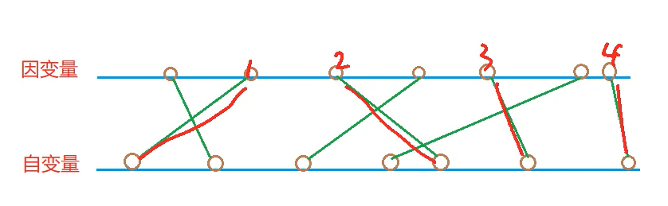

[1012. 友好城市](https://www.acwing.com/problem/content/1014/)

#### 算法：

*DP* *LIS*

**简化问题**

- 每个城市上只能建立一座桥

- 所有的桥与桥之间不能相交

- 最多可以建多少桥

我们可以先按照自变量的大小对因变量进行排序：



每个合法的建桥方式都可以对应一个因变量的上升子序列，并且每个因变量的上升子序列也可以对应一个合法的建桥方式，所以所有合法的建桥方式的集合和因变量的上升子序列集合是一一对应的。

这样对得到的因变量序列求 [895. 最长上升子序列](java/practice/AcWing%20895.%20最长上升子序列) 就可以得到最多可以建多少桥了。	

**注意**

河两岸的城市编号都是从小到大的：

对因变量的上升子序列与其对应的自变量子序列进行排序时，我们会发现它们之间的桥是不相交的，也就是合法的建桥方案。

但如果因变量不是上升子序列，排序后就会桥梁就会发生相交，是不合法的建桥方案。

#### 时间复杂度分析：


#### 代码：

```java
import java.util.*;

class Main {
	static final int N = 5010;
	static int n;
	static int[][] city = new int[N][2];
	static int[] f = new int[N];

	public static void main(String[] args) {
		Scanner sc = new Scanner(System.in);
		n = sc.nextInt();
		for (int i = 1; i <= n; i++) {
			city[i][0] = sc.nextInt();
			city[i][1] = sc.nextInt();	
		}

		Arrays.sort(city, 1, n + 1, (o1, o2) -> o1[0] - o2[0]);

		int ret = 0;
		for (int i = 1; i <= n; i++) {
			f[i] = 1;
			for (int j = 1; j < i; j++) {
				if (city[i][1] > city[j][1]) {
					f[i] = Math.max(f[i], f[j] + 1);
				}
			}
			ret = Math.max(ret, f[i]);
		}

		System.out.println(ret);
	}
}
```

