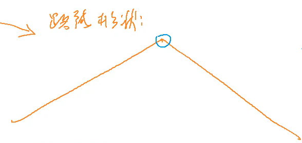

[1014. 登山](https://www.acwing.com/problem/content/1016/)

#### 算法：

*DP* *LIS*

**简化问题**

- 按照编号递增的顺序来浏览 => 必须是子序列

- 相邻两个景点不能相同、一旦开始下降，就不能上升了 => 路线形状：先严格单调递增再严格单调递减

- 求最多能浏览多少景点 => 所有形状是上面这样的子序列长度的最大值



以顶点的位置来划分所有形状是上面这样的子序列的集合：

- 顶点是 a[1]

- 顶点是 a[2]

  ...

- 顶点是 a[k]：a[1] ~ a[k] 的 [895. 最长上升子序列](java/practice/AcWing%20895.%20最长上升子序列) + a[k] ~ a[n] 的最大下降子序列 - 1

然后取一个 Max。

#### 时间复杂度分析：


#### 代码：

```java
import java.util.*;

class Main {
	static final int N = 1010;
	static int n;
	static int[] h = new int[N];
	static int[] f = new int[N], g = new int[N];

	public static void main(String[] args) {
		Scanner sc = new Scanner(System.in);
		n = sc.nextInt();
		for (int i = 1; i <= n; i++) h[i] = sc.nextInt();

		for (int i = 1; i <= n; i++) {
			f[i] = 1;
			for (int j = 1; j < i; j++) {
				if (h[i] > h[j]) f[i] = Math.max(f[i], f[j] + 1);
			}
		}

		for (int i = n; i >= 1; i--) {
			g[i] = 1;
			for (int j = n; j > i; j--) {
				if (h[i] > h[j]) g[i] = Math.max(g[i], g[j] + 1);
			}
		}

		int ret = 0;
		for (int i = 1; i <= n; i++) {
			ret = Math.max(ret, f[i] + g[i] - 1);
		}
		System.out.println(ret);
	}
}
```

