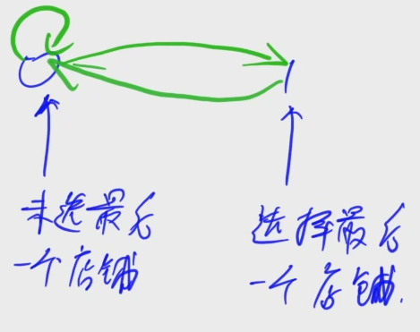

[1049. 大盗阿福](https://www.acwing.com/problem/content/1051/)

#### 算法：

*DP* *状态机模型*

**状态表示 - f(i, 0/1)**

- 集合：所有走了 i 步，且当前位于状态 j 的所有走法

- 属性：Max

**状态计算 - 集合划分**

- 以最后一步的走法来划分 f(i, 0) 表示的集合：
  - 最后一步是 0 -> 0：f(i - 1, 0)
  - 最后一步是 1 -> 0：f(i - 1, 1)

- f(i, 1) 表示的集合的最大值：f(i - 1, 0) + w[i]




任何一种抢劫方案都可以对应状态机中的一个长度为 n 走法；同样的状态机中任意一个长度为 n 的走法都可以对应原问题中的一种抢劫方案。

*Tips*

当状态不好表示的时候，我们可以考虑用状态机的形式把不好表示的状态分离开。

#### 时间复杂度分析：


#### 代码：

```java

```

