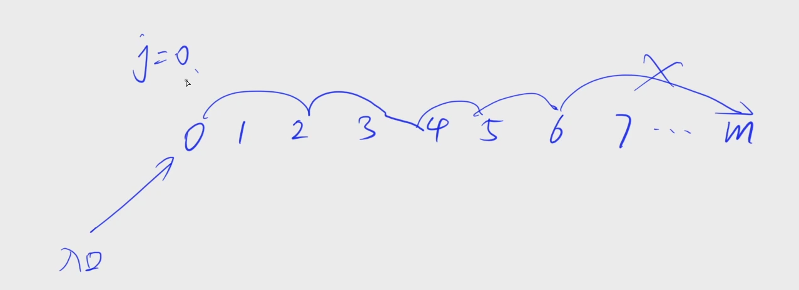
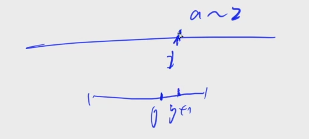
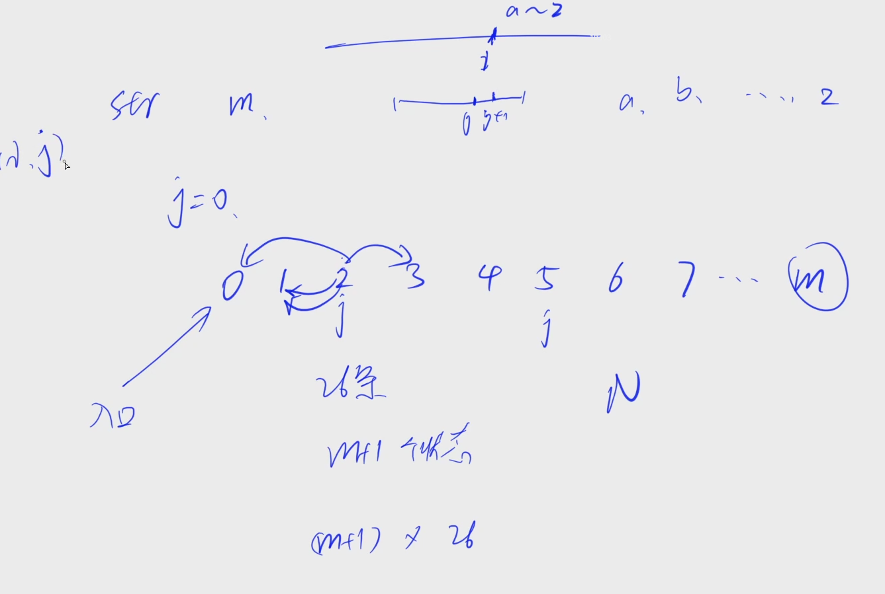

[1052. 设计密码](https://www.acwing.com/problem/content/1054/)

#### 算法：

*DP* *状态机模型*

**状态表示 - f(i, j)**

- 集合：所有写到原字符串的第 i 个字母，且跳到 kmp 中第 j 个状态的时候的方案
- 属性：Count


- kmp 使用一个 j 指针在 T 上从 0 开始往前走，每次 j 能 ++ 就 ++，不能 ++ 就往前跳 next，直到跳到开始为止，我们将它所有跳的位置看成状态，从 0 ~ m 一共 m + 1 个状态

  

- 字符串匹配不包含 T 等价于 j 在跳的时候不能跳到 m（跳到 m 表示包含该字串 T）

- j 跳的时候有那些边呢？

  - 如果 i 和 j + 1 相等，j 就跳到 j + 1
  - 如果 i 和 j + 1 不相等，j 就往前跳

  j 一共有多少种情况取决于 i 位置的取值（a ~ z），所以每个状态 j 都有 26 条边

  

  我们可以直接枚举 i 的取值（a ~ z），找到 j 能跳到什么地方，建出这个状态机

入口在 0 的位置，每次沿着边走，限制是不能走到 m 的情况下，一共走 n 步，一共有多少种不同的路线，因为 i 的每一种合法字符串都会对应一个这样的路线；任何一个这样的路线都可以对应一个合法的字符串。这两个问题是一一对应的，问合法字符串的数量等价于问这样的路径数量。


f(i, j) 枚举到第 i 个字母，j 表示状态


f\[i + 1][u] = (f\[i + 1][u] + f\[i][j]) % mod; 和前面的几题的状态庄毅有些区别

前面的转移是：求当前状态的方案数就是看一下有多少状态能走到它，把能走到它的所有状态加起来。

这道题是看当前状态能更新那些其它状态，我会把我的方案数累加到它能更新到的状态上去。

**这本身是一个状态机模型，状态表示第一维是长度，第二维是在状态机上走到了哪个位置，这里是在枚举在位置j如果沿着k这条边走到u时，对f[i + 1, u]的方案数的贡献**


f\[i][j] 表示前 i 个字符， 和 T 已经匹配到 第 j 位的方案数

- 放一个无法连接的字母

for k=0 to 26
 f\[i][l]+=f\[i−1]\[j](s[j+1]!=k) 
其中 l 为满足 \[1 l] 匹配 \[…k+‘a′] 的最大值。可以用kmp快速实现（或者暴力也许也能过）

- 继续放可以连接的

for k=1 to |T|
f\[i][k]+=f\[i−1][k−1];

- 初始状态：f\[0][0]=1;
- 目标 sum(f\[n][0−(|T|−1)])


如何判断某一种方案是可能的呢？联系KMP的子串匹配方法，就是判断对于固定的 i 和 j 判断当前字符是不是和子串中 j+1 的字符匹配，匹配就j++，不匹配 j 就回跳，如果我们到最后，也就是 i = 26 的时候都没办法使 j 到子串的末尾，那么就意味着我们的密码中没有子串，也就是一种可能。

根据上面的分析，我们再来看这个状态的定义，想一想状态方程，因为每一个字母都对于固定的 i 和 j 都有固定的判断结果，那么我们只要对





#### 时间复杂度分析：


#### 代码：

```java

```

