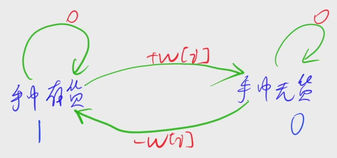

[1057. 股票买卖 IV](https://www.acwing.com/problem/content/1059/)

#### 算法：

*DP* *状态机模型*

**状态表示 - f(i, j, 0/1)**

- 集合

  - 所有只考虑前 i 天，且已经进行完 j 次交易、手中无货的购买方式

  - 所有只考虑前 i 天，且已经进行完 j - 1 次交易，且正在进行第 j 次交易、手中有货的购买方式

- 属性：Max

**状态计算 - 集合划分**

- f(i, j, 0) = max(f(i - 1, j, 0), f(i - 1, j, 1) + w[i])

- f(i, j, 1) = max(f(i - 1, j , 1)， f(i - 1, j - 1, 0) - w[i])



**注意**

状态初始化只有两种情况，0 表示这个状态合法；1 表示这个状态不合法

- f(i, 0, 0)：前 i 天，进行 0 次交易、手中无货这个状态是可能存在的，所以初始化为 0

- f(i, 0, 1)：前 i 天，进行 0 次交易、手中有货这个状态是不可能存在的，我们不希望用到这个状态，所以初始化为 -无穷

#### 时间复杂度分析：


#### 代码：

```java

```

