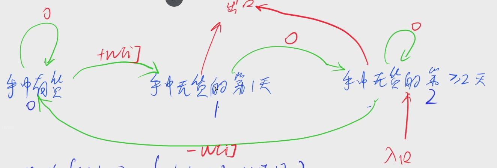

[1058. 股票买卖 V](https://www.acwing.com/problem/content/1060/)

#### 算法：

*DP* *状态机模型*

**状态表示 - f(i, 0/1/2)**

- 集合：所有只考虑前 i 天，且状态是 j 的购买方式

- 属性：Max

**状态计算 - 集合划分**

f(i, 0) = max(f(i - 1, 0), f(i - 1, 2) - w[i])

f(i, 1) = f(i - 1, 0) + w[i]

f(i, 2) = max(f(i - 1, 1), f(i - 1, 2))



#### 时间复杂度分析：


#### 代码：

```java

```

