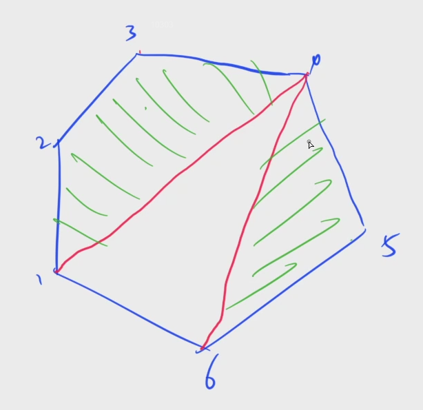

[1069. 凸多边形的划分](https://www.acwing.com/problem/content/1071/)

#### 算法：

*DP* *区间 DP*

**简化题目**

与 [320. 能量项链](java/practice/AcWing%20320.%20能量项链.md) 类似。

将这个凸多边形划分成 N − 2 个互不相交的三角形，所以这三部分相互独立，分别取最小值：f(1, 4) + f(4, 6) + w[1] * w[4] * w[6]



**状态表示 - f(i, j)**

- 集合：所有将多边形 (i, i + 1), (i + 1, i + 2), ..., (j - 1, j), (j, i) 划分为三角形的方案

- 属性：Min

**状态计算 - 集合划分**

以任意一条边，比如 (i, j) 属于哪个三角形来划分 f(i, j) 表示的集合：

- 边 (i, j) 属于三角形 (i, k, j)：f(i, k) + f(k, j) + w[i] * w[k] * w[j]

**Tips**

高精度的题目的一般做法：先不写高精度，将样例作对；然后再将其中需要用到高精度的部分，替换成高精度代码。

#### 时间复杂度分析：


#### 代码：

```java

```

