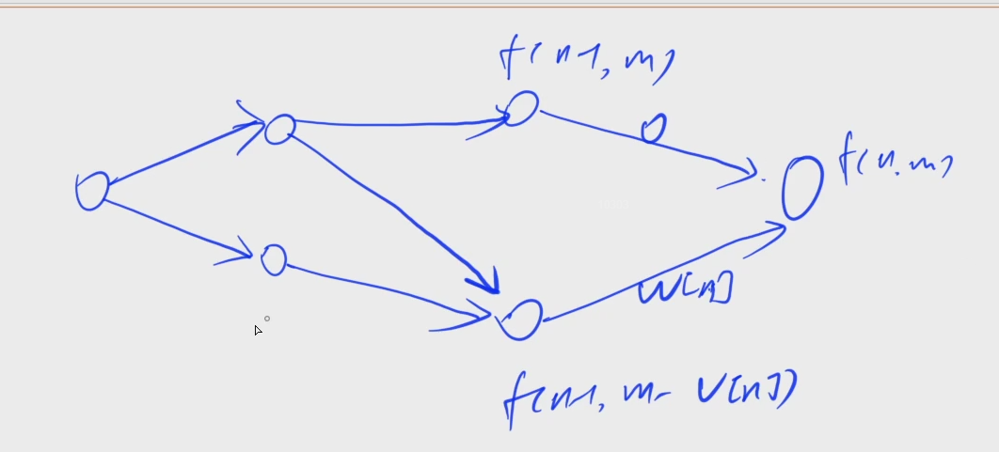

[12. 背包问题求具体方案](https://www.acwing.com/problem/content/12/)

#### 算法:

*DP* *背包问题*

**简化问题**

求具体方案就是判断每个物品是否被选。

f(i, j) = max(f(i - 1, j), f(i -1, j - v[i]) + w[i])：

- 第一项代表不选第 i 个物品

- 第二项代表选第 i 个物品

对应最短路问题，求最短路径：



**注意**

- 不能用状态压缩的方式，必须把两个状态都写出来。

- 在求每个物品是否被选的时候，其实就是反推当前这个状态是从哪个状态过来的，它和哪个状态相等就表示可以从哪个状态过来。

- 对于字典序最小限制：90% 可以使用贪心思路得到。

  从前往后考虑问题，对于第 i 个物品：

  - 只能选：必选

  - 只能不选：必不选

  - 可选可不选：一定选，这样字典序最小

  对于本题，在我们完成所有状态转移后，只能从后往前推，顺序是反着的，为了能让我们能从前往后推，只需要在求解 01 背包的时候，从后往前推就行了，这样在求字典序的时候就可以从第一个物品推到最后一个物品。

#### 时间复杂度分析：


#### 代码：

```java
import java.util.*;

class Main {
	static final int N = 1010;
	static int[] v = new int[N], w = new int[N];
	static int[][] f = new int[N][N];

	public static void main(String[] args) {
		Scanner sc = new Scanner(System.in);
		int n = sc.nextInt(), m = sc.nextInt();

		for (int i = 1; i <= n; i++) {
			v[i] = sc.nextInt();
			w[i] = sc.nextInt();
		}

		for (int i = n; i >= 1; i--) {
			for (int j = 0; j <= m; j++) {
				f[i][j] = f[i + 1][j];
				if (j >= v[i]) f[i][j] = Math.max(f[i][j], f[i + 1][j - v[i]] + w[i]);
			}
		}

		for (int i = 1, j = m; i <= n; i++) {
			if (j >= v[i] && f[i][j] == f[i + 1][j - v[i]] + w[i]) {
				System.out.print(i + " ");
				j -= v[i];
			}
		}
	}
}
```

