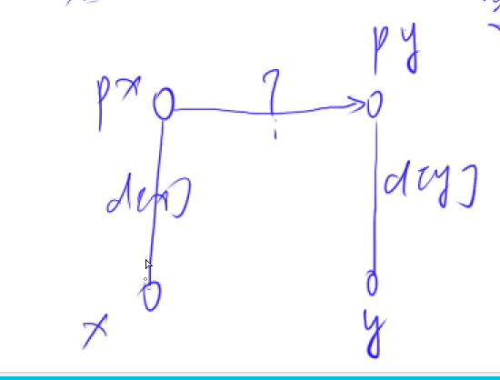

[240. 食物链](https://www.acwing.com/problem/content/242/)

#### 算法：

*#并查集*

因为在同一集合中的所有动物关系一定可以通过推理得到，所以只要我们知道两个动物的关系，就将它们放入到一个集合中。

集合中一个节点到根结点的距离模 3：

- 余 1 表示该节点对应的动物可以吃根结点对应的动物。
- 余 2 表示该节点对应的动物可以被根结点对应的动物吃。
- 余 3 表示该节点对应的动物与根结点对应的动物是同类。

**具体算法**

当 x 和 y 是同类时

1. 如果 x 和 y 属于同一个集合，说明 x 和 y 关系之前已经添加过了，现在只需要判断它们的关系与现在的话所给定的关系（同类）是否相同（当前的话与前面的某些真的话冲突，就是假话）。

   如果 x 和 y 两节点到根结点的距离模 3 相等，说明之前的话中 x 和 y 的关系是同类，否则，不是同类。

   

2. 如果 x 和 y 属于同一个集合，说明 x 和 y 关系之前没有添加过了，现在添加。

当 x 和 y 是捕食关系时，同理。

#### 时间复杂度分析：


#### 代码：

```java
import java.util.*;

class Main {
    static final int N = 50050, M = 100010;
    static int n, k;
    // 数组 p 存储每个点的父亲节点, d[x] 存储 x 到 p[x] 的距离
    static int[] p = new int[N], d = new int[N];
    
    static int find(int x) {
        if (p[x] != x) {
            int u = find(p[x]);
            d[x] += d[p[x]];
            p[x] = u;
        }
        return p[x];
    }
    
    public static void main(String[] args) {
        Scanner sc = new Scanner(System.in);
        n = sc.nextInt();
        k = sc.nextInt();
        
        for (int i = 1; i <= n; i++) p[i] = i;
        for (int i = 1; i <= n; i++) d[i] = 0;
        
        int ret = 0;
        while (k-- > 0) {
            int op = sc.nextInt(), x = sc.nextInt(), y = sc.nextInt();
            if (x > n || y > n) ret++;
            else {
                int px = find(x), py = find(y);
                if (op == 1) {
                    if (px == py && (d[x] - d[y]) % 3 != 0) ret++;
                    else if (px != py) {
                        p[px] = py;
                        d[px] = d[y] - d[x];
                    }
                } else {
                    if (px == py && (d[x] - d[y] - 1) % 3 != 0) ret++;
                    else if (px != py) {
                        p[px] = py;
                        d[px] = d[y] - d[x] + 1;
                    }
                }
            }
        }
        
        System.out.println(ret);
    }
}
```

