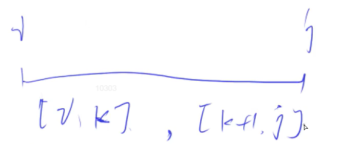

[282. 石子合并](https://www.acwing.com/problem/content/284/)

#### 算法：

*#DP#区间DP*

**状态表示 - f(i, j)**

- 集合：所有将第 i 堆石子到第 j 堆石子合并成一堆石子的合并方式。
- 属性：Min

**状态计算 - 集合划分**

以最后一次合并的分界线来划分 f(i, j) 表示的集合：

- 最后一次合并时，左边有 1 堆石子：

- 最后一次合并时，左边有 2 堆石子：

  ...

- 最后一次合并时，左边有 k - i 堆石子：先分别将 [i, k] 和 [k + 1, j] 两区间内的若干石子堆合并，然后再合并这两个区间，f(i, k) + f(k + 1, j) + s[j] - s[i - 1]。



综上：f(i, j) = min(f(i, k) + f(k + 1, j) + s[j] - s[i - 1])，k ∈ [i, j - 1]。状态计算时，按照区间 [i, j] 的长度从小到大来枚举，这样可以保证状态计算时所依赖的状态已经提前算好了。

#### 时间复杂度分析：

状态数量是 n<sup>2</sup>，状态转移的数量是 n，所以总时间复杂度为 O(n<sup>3</sup>)。

#### 代码：

```java
import java.util.*;

class Main {
    static final int N = 310;
    static int n;
    static int[] s = new int[N];
    static int[][] f = new int[N][N];
    
    public static void main(String[] args) {
        Scanner sc = new Scanner(System.in);
        n = sc.nextInt();
        for (int i = 1; i <= n; i++) s[i] = sc.nextInt();
        for (int i = 1; i <= n; i++) s[i] += s[i - 1];
        
        for (int len = 2; len <= n; len++) {
            for (int i = 1; i + len - 1 <= n; i++) {
                int l = i, r = i + len - 1;
                f[l][r] = 0x3f3f3f3f;
                for (int k = l; k < r; k++) {
                    f[l][r] = Math.min(f[l][r], f[l][k] + f[k + 1][r] + s[r] - s[l - 1]);
                }
            }
        }
        
        System.out.println(f[1][n]);
    }
}
```

