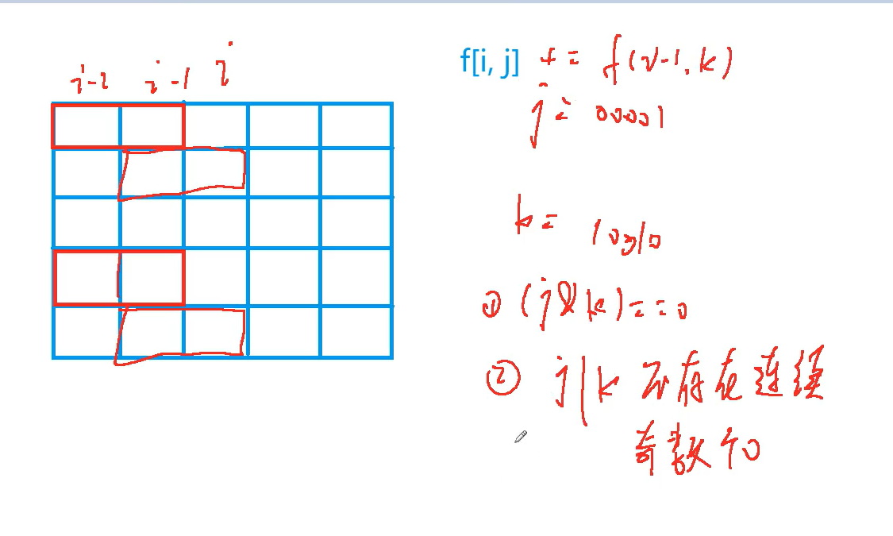

[291. 蒙德里安的梦想](https://www.acwing.com/problem/content/293/)

#### 算法：

*#DP#状态压缩DP*

**化简问题**

将 N * M 的棋盘分割成若干个 1 * 2 的的长方形，可以看做在 N * M 的棋盘中放置 1 * 2 的小方格。

当我们将所有横向小方格放完后，所有纵向小方格的放置情况就都确定了，也就是说整个划分的方式数和横向小方格摆放的方式数是相等的，所以我们只要统计横向小方格的摆放方式就可以了。

**状态表示 - f(i, j)**

- 集合：所有摆到了第 i 列，并且上一列横着放的小方格状态是 j 的情况下的方案。

  其中 j 是二进制数，表示上一列哪些位置的小方格是横着放的（上一列竖着放不会影响当前列的摆放）。

- 属性：Count

**状态计算**

一列一列计算，通过枚举上一个状态来计算当前状态：

- 上一个状态是 f(i - 1, 0)：

- 上一个状态是 f(i - 1, 1：

  ...

- 上一个状态是 f(i - 1, k)：上一个状态的上一列状态是 k

  - 当 (j & k) == 0 时，当前状态才与上一个状态不冲突，也就是 i - 1 列和 i - 2 列不存在横着放置的小方块相互覆盖的情况。
  - 当 j | k 不存在连续奇数个 0 时，竖向放置的小方格才能填充完整个棋盘。

综上：f(i, j) = ∑f(i - 1, k)，其中 k 是所有的合法情况。



#### 代码复杂度分析：


#### 代码：

```java
import java.util.*;

class Main {
    static final int N = 12, M = 1 << N;
    static int n, m;
    static long[][] f = new long[N][M];
    static boolean[] st = new boolean[M];
    
    public static void main(String[] args) {
        Scanner sc = new Scanner(System.in);
        n = sc.nextInt();
        m = sc.nextInt();
        while (n != 0 || m != 0) {
            // 预处理 j | k 的结果
            for (int i = 0; i < 1 << n; i++) {
                int cnt = 0; // 记录列中连续的 0 的个数
                st[i] = true;
                for (int j = 0; j < n; j++) {
                    if ((i >> j & 1) == 1) {
                        // 若列中存在奇数个 0，则这种状态无法竖向防止小方块
                        if ((cnt & 1) == 1) {
                            st[i] = false;
                            break;
                        }
                    } else cnt++;
                }
                // 判断最后一段是否是奇数个 0
                if ((cnt & 1) == 1) st[i] = false;
            }
            
            for (var arr : f) Arrays.fill(arr, 0);
            f[0][0] = 1;
            // 一列一列计算
            for (int i = 1; i <= m; i++) {
                for (int j = 0; j < 1 << n; j++) {
                    for (int k = 0; k < 1 << n; k++) {
                        if ((j & k) == 0 && st[j | k]) {
                            f[i][j] += f[i - 1][k];
                        }
                    }
                }
            }
            
            System.out.println(f[m][0]);
            
            n = sc.nextInt();
            m = sc.nextInt();
        }
    }
}
```

