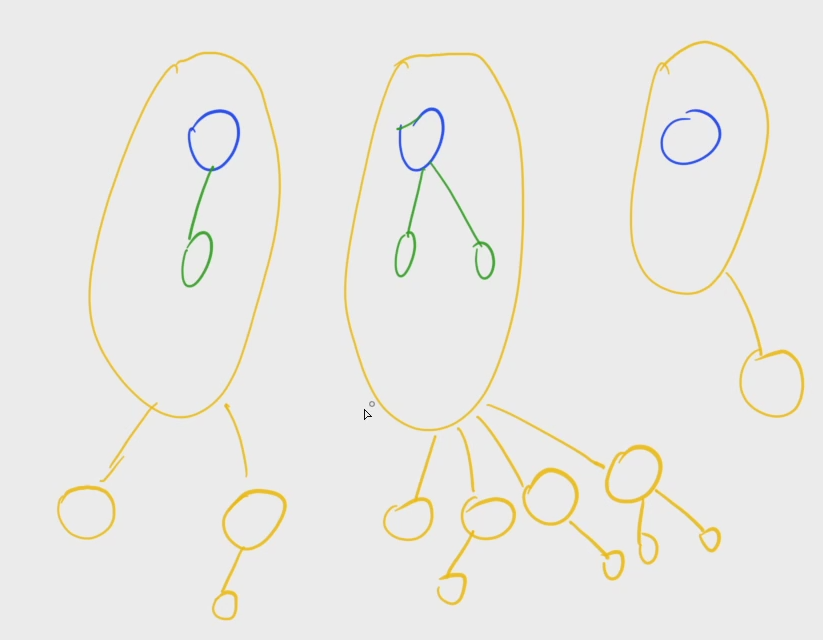

[487. 金明的预算方案](https://www.acwing.com/problem/content/489/)

#### 算法：

*DP* *背包问题*

**简化问题**

- 将每套主副件看成一组物品，每组物品中的物品种类为主件、主件 + 一个附件、主件 + 另一个附件、主件 + 两个附件；

- 限定的 N 元就是总容积，每件物品的价格与重要度的乘积的总和就是价值。

这样原问题就转化为分组背包问题了。



**tips**

每组物品中的不同种类的物品使用二进制枚举：

```java
for (int k = 0; k < 1 << servent[i].size(); k++) {
	// 其中每个 k 代表选取哪个附件
	// 00 01 10 11
}
```


#### 时间复杂度分析：


#### 代码：

```java
import java.util.*;

class Main {
	static final int N = 60, M = 32010;
	static int[][] master = new int[N][2];
	static List<int[]>[] servent = new ArrayList[N];
	static int[] f = new int[M];

	public static void main(String[] args) {
		Scanner sc = new Scanner(System.in);
		int m = sc.nextInt(), n = sc.nextInt();
		for (int i = 1; i <= n; i++) servent[i] = new ArrayList<>();

		for (int i = 1; i <= n; i++) {
			int v = sc.nextInt(), p = sc.nextInt(), q = sc.nextInt();
			int w = v * p;
			if (q == 0) {
				master[i] = new int[]{v, w};
			} else {
				servent[q].add(new int[] {v, w});
			}
		}

		for (int i = 1; i <= n; i++) {
			for (int j = m; j >= 0; j--) {
				for (int k = 0; k < 1 << servent[i].size(); k++) {
					int v = master[i][0], w = master[i][1];
					for (int u = 0; u < servent[i].size(); u++) {
						if ((k >> u & 1) == 1) {
							v += servent[i].get(u)[0];
							w += servent[i].get(u)[1];
						}
					}
					if (j >= v) f[j] = Math.max(f[j], f[j - v] + w);
				}
			}
		}

		System.out.println(f[m]);
	}
}
```

