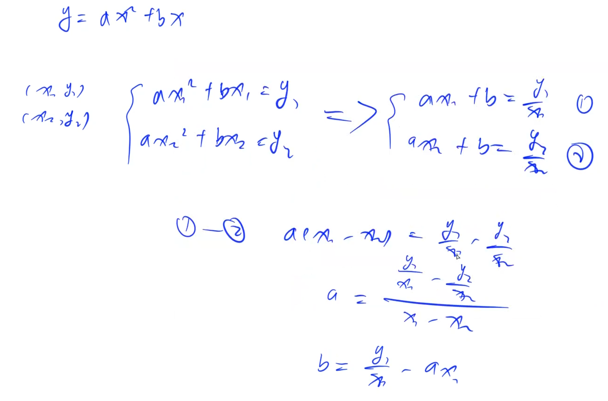
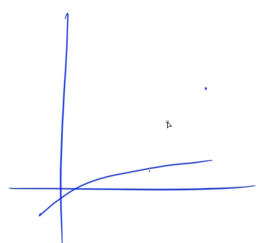

[524. 愤怒的小鸟](https://www.acwing.com/problem/content/526/)

#### 算法：

*DP* *状态压缩*

重复覆盖问题：给定一个 01 矩阵，让我们选择尽量少的行，可以让每一列都至少包含一个 1

精确覆盖问题：给定一个 01 矩阵，最少选择多少行，可以使得每一列选且只选一个 1


重复覆盖问题爆搜实现：

```java
void dfs(int state, int cnt) { // state 存储当前那些列已被覆盖，cnt 当前用的抛物线数
    if (state 已经包含所有列) {
        ans = Math.min(ans, cnt);
        return;
    }
    任选没有被覆盖的一列 x
    枚举所有能覆盖 x 的抛物线
        更新一下 state -> newState
        dfs(newState, cnt + 1);
}
```

返回的 ret 与 state 是一一对应的，只要 state 是确定的最终的结果 ret 一定是确定的，我们可以使用 f(state) 存储当前计算的值，避免重复计算




一般抛物线方程：y=ax2+bx+c
题目中的抛物线有两个特点：

- 过原点, 即 c=0

- 开口向下，即 a<0

因此抛物线方程为：y=ax2+bx，有两个未知数，因此两点即可确定一条抛物线。

因此最多有 n<sup>2</sup> 个不同的抛物线。接下来求出所有不同的抛物线，及其能覆盖的所有点的点集。

此时问题变成了经典的“重复覆盖问题”，即给定01矩阵，要求选择尽量少的行，将所有列覆盖住。这里标准做法是使用 Dancing Links。
但由于 n<=18，因此可以直接使用状态压缩DP求解，代码更简单。

f[i] 表示当前已经覆盖的列是i时的最小行数。

转移时随便找到当前未被覆盖的某一列 x，然后枚举所有包含 x 的行j来选择即可。

即：f[i | j] = min(f[i | j], f[i] + 1)。

等价于 f(newState) = min(f(newState), f(state) + 1)


path\[i][i] = 1 << i



#### 时间复杂度分析：


#### 代码：

```java

```

