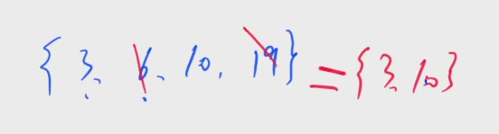

[532. 货币系统](https://www.acwing.com/problem/content/534/)

#### 算法:

*DP* *背包问题*

**分析问题**

- a<sub>1</sub>, a<sub>2</sub>, ..., a<sub>n</sub> 一定都可以被表示出来

  即 a<sub>i</sub> = b<sub>1</sub> * t<sub>1</sub> + b<sub>2</sub> * t<sub>2</sub> + ... + b<sub>m</sub> * t<sub>m</sub>，其中 t<sub>i </sub> >= 0

- 在最优解中，b<sub>1</sub>, b<sub>2</sub>, ..., b<sub>m</sub> 一定都是从 a<sub>1</sub>, a<sub>2</sub>, ..., a<sub>n</sub> 中选择的



- b<sub>1</sub>, b<sub>2</sub>, ..., b<sub>m</sub> 一定不能被其它 b<sub>i</sub> 表示出来

因为值比较大的数一定是值比较小的数表示出来的，所以从小到大枚举每个数，判断当前数 a<sub>i</sub> 能不能被 a<sub>1</sub> ~ a<sub>i - 1</sub> 表示出来

- 如果能被表示出来：一定不选

- 如果不能被表示出来：必选

**简化问题**

把每个 a<sub>i</sub> 都看成一个物品，每个物品有无限个，把它们的总和看成背包体积，判断能不能表示出 a<sub>i</sub> 等价于能不能用 a<sub>1</sub> ~ a<sub>i - 1</sub> 装满体积恰好是 a<sub>i</sub> 的背包。

或者说使用上一题的思路，求出装满各种体积背包的方案数，来判断装满 a<sub>i</sub> 的背包的方案数是不是 0。

#### 时间复杂度分析：


#### 代码：

```java
import java.util.*;

class Main {
	static final int N = 110, M = 25010;
	static int[] a = new int[N];
	static boolean[] f = new boolean[M];

	public static void main(String[] args) {
		Scanner sc = new Scanner(System.in);
		int T = sc.nextInt();
		while (T-- > 0) {
			int n = sc.nextInt();
			for (int i = 0; i < n; i++) a[i] = sc.nextInt();
			Arrays.sort(a, 0, n);
			int m = a[n - 1];

			Arrays.fill(f, false);
			f[0] = true;

			int ret = 0;
			for (int i = 0; i < n; i++) {
				if (!f[a[i]]) ret++;
				for (int j = a[i]; j <= m; j++) {
					f[j] |= f[j - a[i]];
				}
			}

			System.out.println(ret);
		}
	}
}
```

