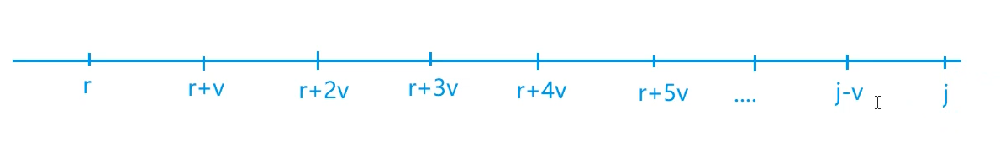
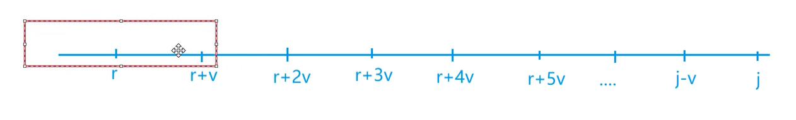
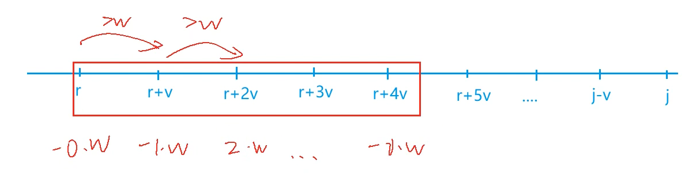

[6. 多重背包问题 III](https://www.acwing.com/problem/content/6/)

#### 算法：

*DP* *背包问题* *滑动窗口*

**优化**

> f(i, j) = max(f(i - 1, j), f(i - 1, j - v[i]) + w[i], f(i - 1, j - 2 * v[i]) + 2 * w[i], ..., f(i - 1, j - s[i] * v[i]) + s[i] * w[i]) 
>
> f(i, j - v[i]) = max(f(i - 1, j - v[i]), f(i - 1, j - 2 * v[i]) + w[i], ..., f(i - 1, j - s[i] * v[i]) + (s[i] - 1) * w[i], f(i - 1, j - (s[i] + 1) * v[i]) + s[i] * w[i])
>
> ...

图中每个位置代表 j - k * v[i]，因为 j, j - v, j - 2 * v, ... 这些点 % v 余数都相同，所以我们可以先把余数 r 设出来，然后在数轴上用余数 r 表示这些点。



f(i, j) 求的就是从 j 到 j - s * v 的一个最大值，也就是求的一个长度为 s + 1 的窗口内的最大值，记得加偏移量。


如果前面数的个数不足 s + 1 的有多少算多少 ，如果足的话就是求相邻 s + 1 个数的最大值。



**偏移量**

> f(i, j) = max(f(i - 1, j), f(i - 1, j - v) + w, f(i - 1, j - 2 * v) + 2 * w, `f(i - 1, j - 3 * v) + 3 * w`, ...)
>
> f(i, j - v) = max(f(i - 1, j - v), f(i - 1, j - 2 * v) + w, `f(i - 1, j - 3 * v) + 2 * w`, ...)
>
> f(i, j - 2 * v) = max(f(i - 1, j - 2 * v), `f(i - 1, j - 3 * v) + w`, ...)
>
> f(i, j - 3 * v) = max(`f(i - 1, j - 3 * v)`, ...)

上面的项比对应的下面的项多一个 w[i]，但因为我们求的是所有值的相对大小，所以没有关系。

我们只需要在滑动窗口从左往右滑动时，将窗口中的值和当前值分别减去 (x - r) / v * w 再进行比较即可。



**注意**

我们是从小到大来枚举所有体积的，因此会先计算 f(j - v)，这样在计算 f(j) 时，f(j - v) 已经被更新过了，也就是说 f(j - v) 存的是第 i 层的 j - v，但我们要用的是第 i - 1 层的 j - v，所以我们不能使用一维数组来做，要用一个滚动数组来存储上一层的状态。

#### 时间复杂度分析：


#### 代码：

```java
import java.util.*;

class Main {
	static final int N = 20010;
	static int[] f = new int[N], g = new int[N];
	static int[] q = new int[N];

	public static void main(String[] args) {
		Scanner sc = new Scanner(System.in);
		int n = sc.nextInt(), m = sc.nextInt();
		for (int i = 0; i < n; i++) {
			int v = sc.nextInt(), w = sc.nextInt(), s = sc.nextInt();
			g = Arrays.copyOf(f, N);
			for (int j = 0; j < v; j++) { // 枚举余数
				int hh = 0, tt = -1;
				for (int k = j; k <= m; k += v) { // 余数固定，枚举数轴上的点
					if (hh <= tt && q[hh] < k - s * v) hh++; // 判断队首元素是否划出窗口
					while (hh <= tt && g[q[tt]] - (q[tt] - j) / v * w < g[k] - (k - j) / v * w) tt--;
					q[++tt] = k;
					f[k] = g[q[hh]] + (k - q[hh]) / v * w;
				}
			}
		}

		System.out.println(f[m]);
	}
}
```

